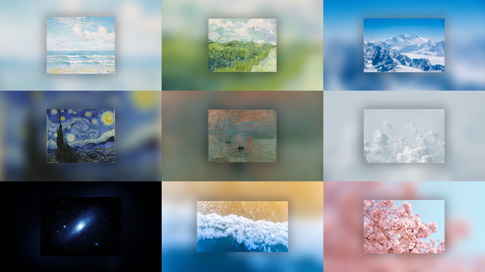
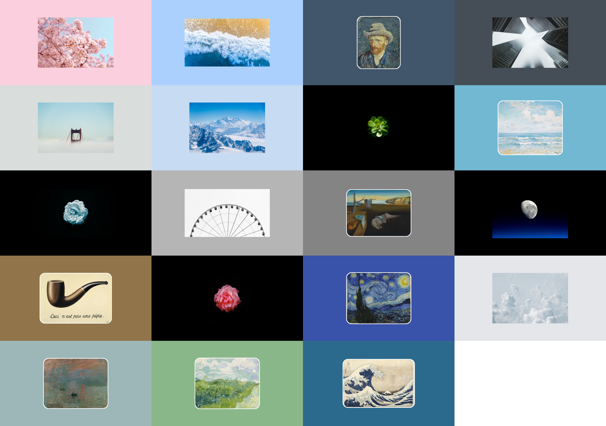

[English](README.md) | 中文

# 艺术映像

## 关于迁移

> [!Note]
> 原仓库体积过大、制作工作流复杂、作品繁而不精，已于 2025-10-31 迁移，完全重写了版本历史，原仓库已归档。

| 比较项   | [原仓库](https://github.com/Somnia1337/Art-Wallpaper-8K) | [本仓库](https://github.com/Somnia1337/Art-Wallpaper)                    |
| -------- | -------------------------------------------------------- | ------------------------------------------------------------------------ |
| 规格     | 8K (7680x4320)                                           | 4K (3840x2160)                                                           |
| 作品     | 名画 摄影 Minecraft                                | 名画 (部分删减) 摄影 (部分删减)                                       |
| 创作方法 | 网页 + 开发者工具截图                                    | 命令行工具 [ArtWall](https://github.com/Somnia1337/ArtWall) + 自动化脚本 |
| 特点     | 制作流程复杂 依赖手工操作 可复现性差               | 制作快速可定制 脚本自动执行 可复现性好                             |

## 亲手定制壁纸

通过 [ArtWall](https://github.com/Somnia1337/ArtWall) 这款命令行工具，您也可以创作类似风格的、可定制的壁纸，详见该仓库。

## 作品集

**Blur** 风格：原图居中，可选 _阴影_；背景为原图本身，可量化控制 _模糊_。

**Color** 风格：原图居中，可量化控制 _圆角_ 和 _边框_；背景为指定的 _纯色_。

## 原作品

**摄影** 原作品：挑选自 [Unsplash](https://unsplash.com/)，这里不作列举。

**名画** 原作品：

| 作品名                           | 艺术家                            | 年份  |
| -------------------------------- | --------------------------------- | ----- |
| Green Wheat Fields               | 文森特·梵高 (Vincent van Gogh)    | 1890  |
| Impression, Sunrise              | 克劳德·莫奈 (Claude Monet)        | 1872  |
| Marine                           | 查尔斯·阿塔米安 (Charles Atamian) | 未知  |
| Self-Portrait with Grey Felt Hat | 文森特·梵高 (Vincent van Gogh)    | 1887  |
| The Great Wave off Kanagawa      | 葛饰北斋 (Katsushika Hokusai)     | ~1831 |
| The Persistence of Memory        | 萨尔瓦多·达利 (Salvador Dalí)     | 1931  |
| The Starry Night                 | 文森特·梵高 (Vincent van Gogh)    | 1889  |
| The Treachery of Images          | 雷内·马格利特 (René Magritte)     | 1929  |
