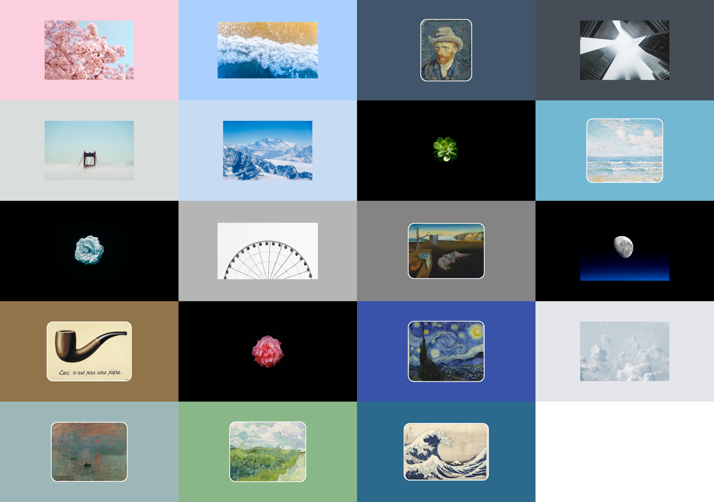

English | [中文](README-ZH.md)

# Art-Wallpaper

## About the migration

> [!Note]
> The original repository was too large, had a complex production workflow, and contained too many works of uneven quality. As of 2025-10-31, it has been migrated, and the version history has been completely rewritten. The old repository has been archived.

| Comparison           | [Original repo (archived)](https://github.com/Somnia1337/Art-Wallpaper-8K) | [This repo](https://github.com/Somnia1337/Art-Wallpaper)                       |
| -------------------- | -------------------------------------------------------------------------- | ------------------------------------------------------------------------------ |
| Resolution           | 8K (7680×4320)                                                             | 4K (3840×2160)                                                                 |
| Content              | Paintings Photography Minecraft                                      | Paintings (reduced) Photography (reduced)                                   |
| Method of recreation | Web pages + Developer Tools screenshots                                    | CLI tool [ArtWall](https://github.com/Somnia1337/ArtWall) + automation scripts |
| Features             | Complex workflow Manual operations Poorly reproducible               | Fast and customizable Fully automated scripts Highly reproducible        |

## Making your own wallpaper

With the help of the CLI tool [ArtWall](https://github.com/Somnia1337/ArtWall), you can make your own similarly styled, customizable wallpaper, check out the repo for more.

## Collection

**Blur** style: The original image is centered, with an optional _shadow_; the background is the image itself, with adjustable _blur intensity_.

**Color** style: The original image is centered, with adjustable _round corner_ and _frame width_; the background is a specified _solid color_.

## Original artwork

**Photography** original: selected from [Unsplash](https://unsplash.com/), which aren't listed here.

**Paintings** original:

| Title                            | Artist             | Year    |
| -------------------------------- | ------------------ | ------- |
| Green Wheat Fields               | Vincent van Gogh   | 1890    |
| Impression, Sunrise              | Claude Monet       | 1872    |
| Marine                           | Charles Atamian    | unknown |
| Self-Portrait with Grey Felt Hat | Vincent van Gogh   | 1887    |
| The Great Wave off Kanagawa      | Katsushika Hokusai | ~1831   |
| The Persistence of Memory        | Salvador Dalí      | 1931    |
| The Starry Night                 | Vincent van Gogh   | 1889    |
| The Treachery of Images          | René Magritte      | 1929    |
